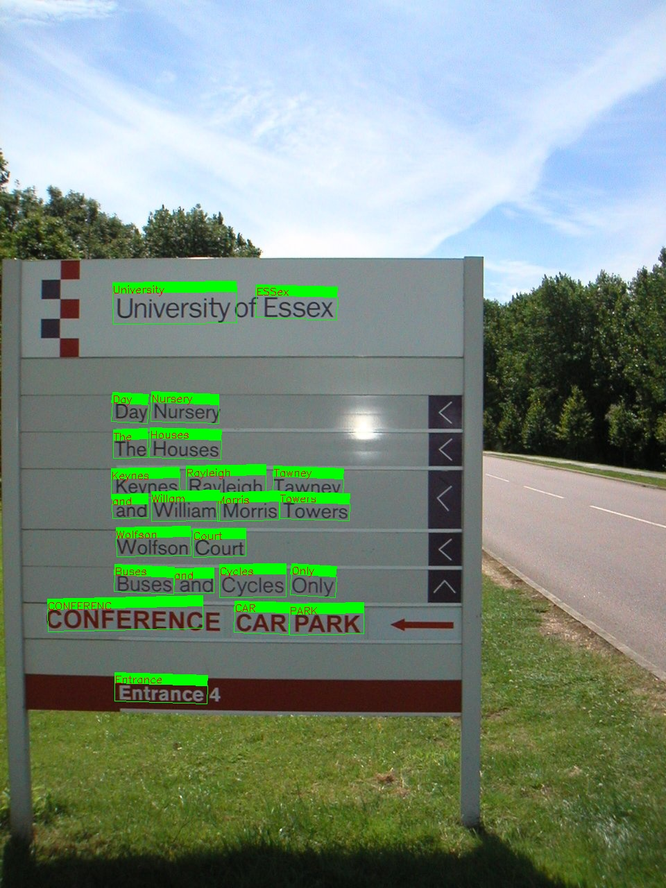

# FOTS: Fast Oriented Text Spotting with a Unified Network

**I am still working on this repo. updates and detailed instructions are coming soon!**

   
   

## Table of Contens
<!-- START doctoc generated TOC please keep comment here to allow auto update -->
<!-- DON'T EDIT THIS SECTION, INSTEAD RE-RUN doctoc TO UPDATE -->


- [TensorFlow Versions](#tensorflow-versions)
- [Other Requirements](#other-requirements)
- [Trained Models](#trained-models)
- [Datasets](#datasets)
- [Train](#train)
  - [Pre-train with SynthText](#pre-train-with-synthtext)
  - [Finetune with ICDAR 2015, ICDAR 2017 MLT or ICDAR 2013](#finetune-with-icdar-2015-icdar-2017-mlt-or-icdar-2013)
- [Test](#test)
- [References](#references)

<!-- END doctoc generated TOC please keep comment here to allow auto update -->

## TensorFlow Versions
As for now, the pre-training code is tested on TensorFlow 1.12, 1.14 and 1.15. I may try to implement 2.x version in the future.

## Other Requirements
GCC >= 6

## Trained Models
  - [tmp pre-trained model](https://drive.google.com/drive/folders/1g5pneiBzmsU4Xw6mnAajF8HHK9L1ho_c?usp=sharing)
  - trained model **comming soon**
## Datasets
- pre-training<br>
[Synth800k](https://www.robots.ox.ac.uk/~vgg/data/scenetext/)(The dataset is only available for non-commercial research and educational purposes)
- finetuning<br>
[ICDAR 2015, 2017MLT, 2013](https://rrc.cvc.uab.es/)

## Train
### Pre-train with SynthText
1. Download [pre-trained ResNet-50](http://download.tensorflow.org/models/resnet_v1_50_2016_08_28.tar.gz) from [TensorFlow-Slim image classification model library](https://github.com/tensorflow/models/tree/master/research/slim) page and place it at 'ckpt/resnet_v1_50' dir.<br>
```
cd ckpt/resnet_v1_50
wget http://download.tensorflow.org/models/resnet_v1_50_2016_08_28.tar.gz
tar -zxvf resnet_v1_50_2016_08_28.tar.gz
rm resnet_v1_50_2016_08_28.tar.gz
```
2. Download [Synth800k dataset](https://www.robots.ox.ac.uk/~vgg/data/scenetext/) and place it at `data/SynthText/` dir to pre-train the whole net.<br>

3. Transform(Pre-process) the SynthText data into the ICDAR data format.<br>
```
python data_provider/SynthText2ICDAR.py
```

4. Train with SynthText for 10 epochs(with 1 GPU).<br>
```
python train.py \
  --max_steps=715625 \
  --gpu_list='0' \
  --checkpoint_path=ckpt/synthText_10eps/ \
  --pretrained_model_path=ckpt/resnet_v1_50/resnet_v1_50.ckpt \
  --training_img_data_dir=data/SynthText/ \
  --training_gt_data_dir=data/SynthText/ \
  --icdar=False \
```
5. Visualize pre-pretraining progress with TensorBoard.
```
tensorboard --logdir=ckpt/synthText_10eps/
```

### Finetune with ICDAR 2015, ICDAR 2017 MLT or ICDAR 2013
(if you are using [the pre-trained model](https://drive.google.com/drive/folders/1g5pneiBzmsU4Xw6mnAajF8HHK9L1ho_c?usp=sharing), place all of the files in `ckpt/synthText_10eps/`)

- Combine ICDAR data before training.
  1. Place ICDAR data under `tmp/` foler.
  2. Run the following script to combine the data.
  ```
  python combine_ICDAR_data.py --year [year of ICDAR to train(13 or 15 or 17)]
  ```

- ICDAR 2017 MLT/pre-finetune for ICDAR 2013 or ICDAR 2015 (text detection task only)
  - Train the pre-trained model with 9,000 images from ICDAR 2017 MLT training and validation datasets(with 1 GPU).
  ```
  python train.py \
    --gpu_list='0' \
    --checkpoint_path=ckpt/ICDAR17MLT/ \
    --pretrained_model_path=ckpt/synthText_10eps/ \
    --train_stage=0 \
    --training_img_data_dir=data/ICDAR17MLT/imgs/ \
    --training_gt_data_dir=data/ICDAR17MLT/gts/
  ```

- ICDAR 2015
  - Train the model with 1,000 images from ICDAR 2015 training dataset and 229 images from ICDAR 2013 training datasets(with 1 GPU).
  ```
  python train.py \
    --gpu_list='0' \
    --checkpoint_path=ckpt/ICDAR15/ \
    --pretrained_model_path=ckpt/ICDAR17MLT/ \
    --training_img_data_dir=data/ICDAR15+13/imgs/ \
    --training_gt_data_dir=data/ICDAR15+13/gts/
  ```

- ICDAR 2013(horizontal text only)
  - Train the model with 229 images from ICDAR 2013 training datasets(with 1 GPU).
  ```
  python train.py \
    --gpu_list='0' \
    --checkpoint_path=ckpt/ICDAR13/ \
    --pretrained_model_path=ckpt/ICDAR17MLT/ \
    --training_img_data_dir=data/ICDAR13/imgs/ \
    --training_gt_data_dir=data/ICDAR13/gts/
  ```

## Test
Place some images in `test_imgs/` dir and specify a trained checkpoint path to see the test result.
```
python test.py --test_data_path test_imgs/ --checkpoint_path [checkpoint path]
```

## References
- Paper
  - [FOTS: Fast Oriented Text Spotting with a Unified Network](https://arxiv.org/abs/1801.01671)<br>
  - [Deep Residual Learning for Image Recognition](https://arxiv.org/abs/1512.03385)<br>
  - [Feature Pyramid Networks for Object Detection](https://arxiv.org/abs/1612.03144)<br>
- Repos
  - https://github.com/yu20103983/FOTS<br>
  - https://github.com/Pay20Y/FOTS_TF/tree/dev<br>
  - https://github.com/tensorflow/models/tree/master/research/slim<br>
  - https://github.com/kaiminghe/deep-residual-networks<br>
  - https://github.com/Parquery/lanms<br>
